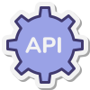
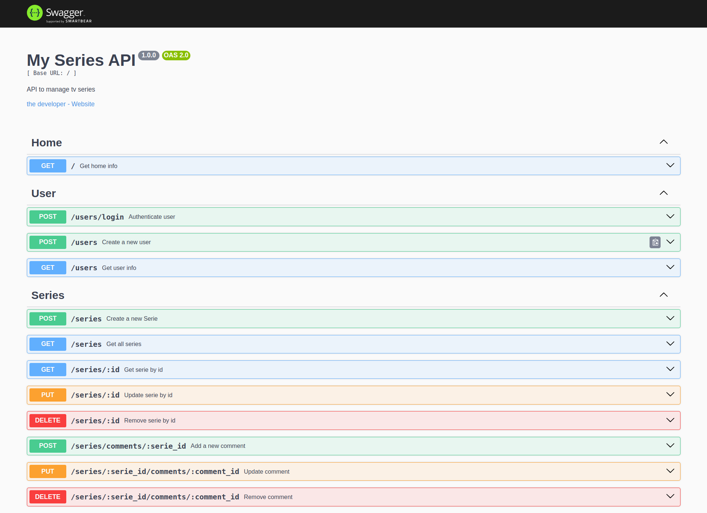

<h1 align="center">
  <br />
  
  <br />
  My Series API
  <br />
</h1>

<h4 align="center">
  API Restfull desenvolvida com NodeJS, ExpressJS, MongoDB, Autenticação por JWT, Testes Automatizados e entre outros recursos.
</h4> 

<p align="center">Data de criação: Mar 17, 2024</p>

<p align="center">
  
  
  
</p>



### Descrição

<b>My Series API</b>, aplicação baseada no projeto <a href="https://github.com/devpleno/fsm-minhas-series-rest">My Series</a>, desenvolvido no curso <b>FullStack Master</b> da plataforma <a href="https://devpleno.com/">Devpleno</a>.

<b>Principais funcionalidades:</b>
  * Criar Usuário
  * Autenticação por JWT
  * Adicionar/Ler/Atualizar e Remover Séries
  * Adicionar/Ler/Atualizar e Remover Comentários de uma Série

### Recursos

Além da ideia do projeto, foi feita a implementação do padrão de projeto <b>Layered Architecture (N Camandas)</b>, <b>Testes Automatizados</b>, documentação da api com <b>Swagger</b> e <b>Docker</b> para a execução completa do projeto.

* API:
  * node:20
  * express: ^4.18.3
  * bcrypt: ^5.1.1
  * cors: ^2.8.5
  * jsonwebtoken: ^9.0.2
  * mongoose: ^8.2.2
  * swagger-ui-express: ^5.0.0
  * jest: ^29.7.0
* DB:
  * mongodb:latest
* Devops:
  * Docker

### Execução

```sh

# Clone Repository
$ git clone https://github.com/EricNeves/mySeries.git

# Install Dependencies
$ cd mySeries && pnpm install

# Execute Docker
$ docker-compose up -d --build

```

### Processos

```sh

# Endpoint - Doc
$ curl -I http://localhost:3333/doc/

HTTP/1.1 200 OK

```

### License 


### Author 🧑‍💻
<a href="https://www.instagram.com/ericneves_dev/"></a> <a href="https://linkedin.com/in/ericnevesrr"> </a>